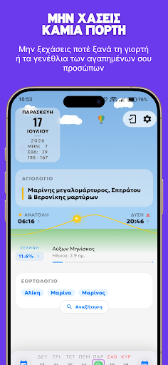
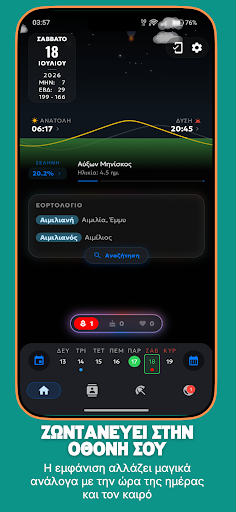
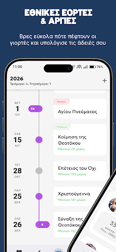
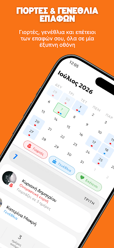
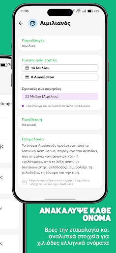
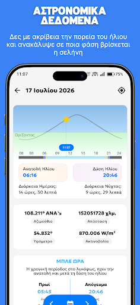
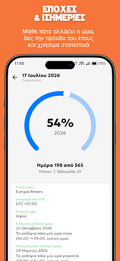

  

# Γιορτές - Το πιο όμορφο & σύγχρονο Εορτολόγιο

Καλώς ήρθατε στο αποθετήριο της εφαρμογής **Γιορτές**! Εδώ θα βρείτε το επίσημο αρχείο εγκατάστασης (APK) για την πιο σύγχρονη, όμορφη και εύχρηστη εφαρμογή εορτολογίου και οργάνωσης καθημερινότητας για συσκευές Android. 

*Σημείωση: Ο πηγαίος κώδικας της εφαρμογής είναι ιδιωτικός. Στο παρόν αποθετήριο διατίθενται μόνο οι επίσημες εκδόσεις εγκατάστασης (APK).*

---

## ✨ Τι Προσφέρει η Εφαρμογή

### 👥 Ονομαστικές Εορτές & Γενέθλια
* **Σήμερα Γιορτάζουν**: Δείτε άμεσα με την εκκίνηση της εφαρμογής ποια ονόματα έχουν την τιμητική τους.
* **Συγχρονισμός με Επαφές**: Η εφαρμογή συνδέεται με τον τηλεφωνικό σας κατάλογο (με απόλυτο σεβασμό στην ιδιωτικότητά σας) για να εντοπίζει αυτόματα και να σας υπενθυμίζει τα γενέθλια, τις ονομαστικές εορτές και τις επετείους των φίλων και συγγενών σας.
* **Άμεση Επικοινωνία**: Στείλτε τις ευχές σας με ένα κλικ μέσω SMS, τηλεφώνου ή των δημοφιλών εφαρμογών μηνυμάτων.

### 📚 Εγκυκλοπαίδεια Ονομάτων
* **Προέλευση & Ετυμολογία**: Ανακαλύψτε τη σημασία, την ιστορία και τις ρίζες πίσω από χιλιάδες ελληνικά ονόματα.

### 🏖️ Αργίες & Παγκόσμιες Ημέρες
* **Επίσημες Αργίες**: Δείτε συγκεντρωμένες όλες τις εθνικές εορτές και τα τριήμερα του έτους για να προγραμματίσετε έγκαιρα τις άδειες και τις αποδράσεις σας.
* **Παγκόσμιες Ημέρες**: Μάθετε καθημερινά για τις διεθνείς και παγκόσμιες ημέρες. Κάθε μέρα κρύβει κάτι ενδιαφέρον!

### 🌙 Αστρονομικά Δεδομένα (Ήλιος & Σελήνη)
* **Ανατολή & Δύση**: Δείτε με ακρίβεια τις ώρες ανατολής και δύσης του ηλίου με βάση την τοποθεσία σας.
* **Φάσεις της Σελήνης**: Παρακολουθήστε την τρέχουσα φάση του φεγγαριού και τη διάρκεια της ημέρας.

### 📊 Στατιστικά & Χρόνος
* **Πορεία του Έτους**: Οπτικοποιήστε την πρόοδο της χρονιάς με όμορφα, δυναμικά γραφικά.
* **Εποχές & Αλλαγή Ώρας**: Μάθετε πότε έχουμε ισημερία, ηλιοστάσιο, καθώς και την ακριβή ημερομηνία για την αλλαγή της ώρας.
* **Αριθμός Εβδομάδας**: Δείτε άμεσα σε ποια εβδομάδα του έτους βρισκόμαστε.

### 📱 Widgets & Ειδοποιήσεις
* **Έξυπνες Ειδοποιήσεις**: Λάβετε καθημερινά διακριτικές υπενθυμίσεις για τις εορτές των επαφών σας, ώστε να μη χάνετε καμία ευκαιρία για ευχές.
* **Πανέμορφα Widgets**: Τοποθετήστε κομψά widget στην αρχική σας οθόνη για να βλέπετε τις σημερινές γιορτές, τις αργίες και τα γενέθλια των επαφών σας με μια ματιά.

### 🎨 Δυναμικός & Έξυπνος Σχεδιασμός
* **Ζωντανό Background**: Το περιβάλλον της εφαρμογής αλλάζει χρώματα και εικόνες ανάλογα με την ώρα της ημέρας και τις καιρικές συνθήκες.
* **Dark Mode**: Πλήρως βελτιστοποιημένο σκοτεινό θέμα για ξεκούραστη χρήση κατά τις νυχτερινές ώρες.

---

## 📸 Στιγμιότυπα Εφαρμογής (Screenshots)

  
  
  
  

  
  
  
  

---

## 📥 Οδηγίες Εγκατάστασης (APK Sideloading)

Για να εγκαταστήσετε την εφαρμογή στο Android κινητό σας, ακολουθήστε τα παρακάτω βήματα:

1. **Κατεβάστε το αρχείο APK**: Μεταβείτε στην ενότητα [Releases](releases/latest) και κατεβάστε το αρχείο `giortes-release.apk`.
2. **Ενεργοποίηση Άγνωστων Πηγών**:
   * Πριν την εγκατάσταση, ίσως χρειαστεί να επιτρέψετε την εγκατάσταση εφαρμογών από «άγνωστες πηγές» (Unknown Sources).
   * Πηγαίνετε στις **Ρυθμίσεις** > **Ασφάλεια** (ή **Προστασία Προσωπικών Δεδομένων**) και ενεργοποιήστε την επιλογή **Εγκατάσταση άγνωστων εφαρμογών** (για το πρόγραμμα περιήγησης ή τον διαχειριστή αρχείων που χρησιμοποιείτε).
3. **Εγκατάσταση**: Ανοίξτε το αρχείο APK που κατεβάσατε και πατήστε **Εγκατάσταση** (Install).
4. **Έτοιμο!**: Μπορείτε πλέον να ανοίξετε την εφαρμογή και να συγχρονίσετε τις επαφές σας.

---

## 🔒 Ιδιωτικότητα & Άδειες (Permissions)

Η εφαρμογή έχει σχεδιαστεί με γνώμονα τον απόλυτο σεβασμό στα προσωπικά σας δεδομένα:

* **Πρόσβαση στις Επαφές (`READ_CONTACTS`)**: Χρησιμοποιείται αποκλειστικά για την εύρεση γενεθλίων και εορτών στον κατάλογό σας. **Κανένα δεδομένο επαφής δεν αποστέλλεται σε εξωτερικούς διακομιστές (servers)**. Όλη η επεξεργασία γίνεται τοπικά στη συσκευή σας.
* **Ειδοποιήσεις (`POST_NOTIFICATIONS`)**: Χρησιμοποιείται για να σας στέλνει τις καθημερινές υπενθυμίσεις εορτών.
